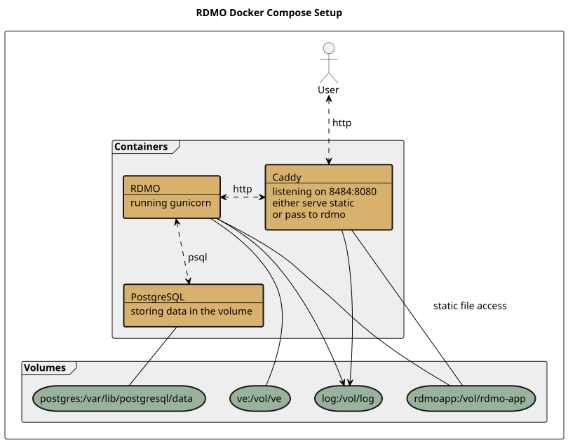

# RDMO Docker Compose 

! *Please note that the configuration mechanism of this docker setup has changed. Configuration is now a plain `.env` file in the root folder of the repository.* Please see [Configuration &amp; Usage](#configuration--usage) for more information.

<!-- toc -->

- [Structure](#structure)
  - [Dockers](#dockers)
  - [Volumes](#volumes)
- [Configuration &amp; Usage](#configuration--usage)
- [Upgrading PostgreSQL](#upgrading-postgresql)
- [Multiple RDMO Instances on a Single Docker Host](#multiple-rdmo-instances-on-a-single-docker-host)

<!-- /toc -->

This repository contains RDMO docker images that are held together by [docker compose](https://github.com/docker/compose/releases) which obviously is required to make use of it. If not configured differently the built RDMO instance should be available at `localhost:8484`. Please see below how setting can be changed.

## Structure

### Dockers

Four containers are going to be created: `Caddy`, `PostgreSQL`, `RDMO`, and a short-lived `fixperms` helper. `caddy`, `postgres` and `rdmo` each run as an unprivileged, UID/GID-mapped user rather than root. `fixperms` runs once, as root, before the other three start: it creates `vol/log` and `vol/postgres` if they don't exist yet and makes sure they (and the rest of `vol/`) are owned by that same UID/GID, then exits. This is only needed because docker would otherwise create missing bind-mount folders as root, which the unprivileged containers couldn't write to; the three long-running services never run as root themselves.

`fixperms` also compares the PostgreSQL major version already on disk (if any) against `POSTGRES_VERSION`. If they don't match, it backs up `vol/postgres` to a timestamped `.tar.gz` next to it and refuses to start the rest of the stack, rather than let a newer postgres either fail confusingly or silently start a fresh, empty database next to your real one. See [Upgrading PostgreSQL](#upgrading-postgresql) if you actually want to move to a new major version.

### Volumes

`VOLDIR` on the docker host (`vol/` next to `docker-compose.yaml` by default, see `VOLDIR` in [Configuration & Usage](#configuration--usage) to relocate it, e.g. to a different disk) holds everything that needs to persist or be shared between containers:

1. `log` log files
2. `postgres` database
3. `rdmo-app` rdmo app installation

Note that `VOLDIR` is bind-mounted directly (not a named docker volume), so any folder created inside it is available inside the `caddy` and the `rdmo` container and may be used to transfer data between the docker host and these two containers.



## Configuration & Usage

1. Declare your settings in a root-level `.env` file

   The basic settings are stored in `.env.defaults`. These settings are loaded and passed to the containers but can be overwritten in a `.env` file next to it in the repository root (this file is git-ignored). You only need to declare the keys you actually want to change; everything else falls back to the defaults.

   Please note that you might need to change the `ALLOWED_HOSTS` entry depending on your server setup. The URL or IP under which RDMO is served needs to be allowed by putting it into the list. Usually the allowed hosts are declared in the `local.py`. In this docker compose setup we decided to move it to an environment variable instead, which might need to be adjusted.

   It is possible to change the restart policy of all three Docker services via changing the `RESTART_POLICY` variable.

   `VOLDIR` controls where persistent data (see [Volumes](#volumes)) is stored on the docker host; it defaults to `./vol` but can be set to an absolute path to store it elsewhere.
2. Build and run the stack

   Plain `docker compose up -d --build` works out of the box, `docker-compose.yaml` ships sensible defaults for every setting. Optionally, install [Task](https://taskfile.dev) for a bit of convenience on top (matches build args to your host UID/GID, adds shortcuts like `task logs` or `task sh`, see `task --list` for all of them) and run `task` instead. Neither is required to use the other.
3. Maybe create an RDMO user

   Note that we decided not to automatically create any user account for the freshly created RDMO instance. You may want to do this manually.

   ```shell
   # connect to the docker
   docker exec -ti rdc-rdmo bash

   # do either
   python manage.py createsuperuser
   # or
   python manage.py create_admin_user
   ```
4. Import data from rdmo-catalog

   A fresh RDMO installation does not contain any data. You may want to import `conditions`, `domains`, `options`, `questions`, `tasks` and `views`. In the `RDMO container` there is a shell script that automatically clones the [rdmo-catalog repo](https://github.com/rdmorganiser/rdmo-catalog) and imports everything in it. If you consider it being helpful you could do `import-github-catalogues.sh`.

## Upgrading PostgreSQL

PostgreSQL 18 changed where it expects to be mounted: versions up to 17 want a bind mount directly at `/var/lib/postgresql/data`, which is what `POSTGRES_DATA_MOUNT` defaults to; 18 and newer want a single mount one level up, at `/var/lib/postgresql`, and manage their own version-named subdirectory (e.g. `vol/postgres/18/docker`) underneath it themselves.

Bumping `POSTGRES_VERSION` alone does not convert existing data to a new major version's format - PostgreSQL major versions can't read each other's on-disk files directly, that needs `pg_dump`/`pg_restore` (or `pg_upgrade` with both binary versions available, which this setup doesn't wire up). `fixperms` guards against doing this by accident: it compares the major version already on disk against `POSTGRES_VERSION`, and if they differ, backs up `vol/postgres` and refuses to start rather than risk it (see [Structure](#structure)).

To actually move to PostgreSQL 18+ on an existing instance:

1. With the stack still on the old version, back up your data properly, e.g.:
   ```shell
   docker exec -t rdc-postgres pg_dump -U rdmo -d rdmo -Fc -f /tmp/rdmo.dump
   docker cp rdc-postgres:/tmp/rdmo.dump ./rdmo.dump
   ```
2. Set `POSTGRES_VERSION=18` (or newer) and `POSTGRES_DATA_MOUNT=/var/lib/postgresql` in your `.env`.
3. Start the stack. `fixperms` will find no existing data under the new layout and let postgres initialize a fresh, empty database.
4. Restore your dump into it:
   ```shell
   docker cp ./rdmo.dump rdc-postgres:/tmp/rdmo.dump
   docker exec -t rdc-postgres pg_restore -U rdmo -d rdmo /tmp/rdmo.dump
   ```

Starting a brand-new deployment directly on PostgreSQL 18+ is simpler: just set both variables above before the first `up` - there's no existing data for `fixperms` to compare against, so it proceeds normally.

## Multiple RDMO Instances on a Single Docker Host

You can have multiple running RDMO instances on a single docker host as long as you pay attention to three things.

1. Use different folders containing the `rdmo-docker-compose` repo to make sure docker compose considers your build attempts to be different projects.
2. Make sure to use different `GLOBAL_PREFIX` settings in your `.env` to avoid conflicts between your docker containers and volumes.
3. And obviously change the `FINALLY_EXPOSED_PORT` settings to make sure to use a free port to expose RDMO.
